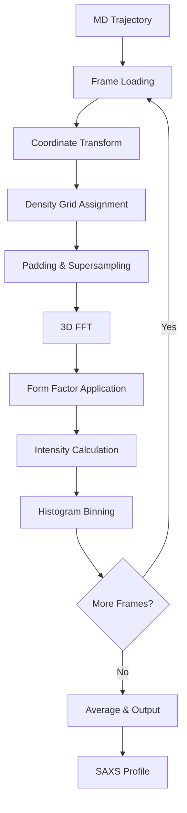

# Pipeline Details

This page provides a detailed walkthrough of the pyCuSAXS computational pipeline, from trajectory loading to final SAXS profile output.

## Pipeline Architecture



## Stage 1: Frame Loading

### Python Layer (MDAnalysis)

**File:** `pycusaxs/topology.py`

**Process:**

1. Load topology file (`.tpr`) with MDAnalysis
2. Open trajectory file (`.xtc`, `.trr`)
3. Stream frames using `iter_frames_stream()`

**Code Flow:**

```python
# Create Universe
u = MDAnalysis.Universe(tpr_file, xtc_file)

# Stream frames
for ts in u.trajectory[start:stop:step]:
    # Extract data
    positions = ts.positions  # Å
    box = ts.dimensions[:3]   # Å
    time = ts.time           # ps

    # Convert to dictionary
    frame_data = {
        'frame': ts.frame,
        'time': time,
        'positions': positions * 10,  # nm to Å
        'box': box * 10                # nm to Å
    }

    yield frame_data
```

**Output:** Frame dictionary with positions and box dimensions

### Double-Buffered Loading

**File:** `cpp-src/Exec/RunSaxs.cu`

**Process:**

1. Load frame $n$ from Python (hold GIL)
2. Transfer data to GPU
3. Release GIL
4. Start processing frame $n$ on GPU
5. While GPU works, load frame $n+1$ from Python
6. Synchronize and repeat

**Benefits:**

- Overlaps CPU I/O with GPU computation
- Minimizes CPU-GPU idle time
- Reduces wall-clock time by 10-20%

## Stage 2: Coordinate Transformation

### Cell Geometry

**File:** `cpp-src/System/Cell.cpp`

**Input:** Box matrix $\mathbf{H}$ and atomic coordinates

**Process:**

1. **Calculate CO Matrix** (Cell-to-Orthonormal):

   For orthorhombic box $(L_x, L_y, L_z)$:
   $$\mathbf{CO} = \begin{pmatrix}
   L_x & 0 & 0 \\
   0 & L_y & 0 \\
   0 & 0 & L_z
   \end{pmatrix}$$

   For triclinic box with angles $\alpha, \beta, \gamma$:
   $$\mathbf{CO} = \begin{pmatrix}
   a & b\cos\gamma & c\cos\beta \\
   0 & b\sin\gamma & c(\cos\alpha - \cos\beta\cos\gamma)/\sin\gamma \\
   0 & 0 & c_z
   \end{pmatrix}$$

2. **Calculate OC Matrix** (Orthonormal-to-Cell):
   $$\mathbf{OC} = \mathbf{CO}^{-1}$$

3. **Transform Coordinates:**
   $$\mathbf{r}'_j = \mathbf{CO} \cdot \mathbf{r}_j$$

**Output:** Orthonormal coordinates and transformation matrices

### CUDA Kernel

**File:** `cpp-src/Saxs/saxsDeviceKernels.cu`

**Kernel:** `rhoCartKernel`

**Thread Organization:**

- Grid: $(N_{\text{atoms}} + 255) / 256$ blocks
- Block: 256 threads

**Per-thread Work:**

```cpp
int atom_idx = blockIdx.x * blockDim.x + threadIdx.x;
if (atom_idx < n_atoms) {
    // Get atom position
    float3 pos = {coords[atom_idx].x, coords[atom_idx].y, coords[atom_idx].z};

    // Apply CO transformation
    float3 transformed = matmul(CO_matrix, pos);

    // Store result
    transformed_coords[atom_idx] = transformed;
}
```

## Stage 3: Density Grid Assignment

### B-spline Interpolation

**File:** `cpp-src/Utilities/BSpline.cpp`

**Mathematical Foundation:**

For B-spline order $n$, the basis function $M_n(u)$ is computed recursively:

$$M_0(u) = \begin{cases} 1 & \text{if } 0 \le u < 1 \\ 0 & \text{otherwise} \end{cases}$$

$$M_n(u) = \frac{u}{n} M_{n-1}(u) + \frac{n+1-u}{n} M_{n-1}(u-1)$$

**For order 4 (cubic B-spline):**

$$M_4(u) = \begin{cases}
\frac{1}{6}u^3 & 0 \le u < 1 \\
\frac{1}{6}(-3u^3 + 12u^2 - 12u + 4) & 1 \le u < 2 \\
\frac{1}{6}(3u^3 - 24u^2 + 60u - 44) & 2 \le u < 3 \\
\frac{1}{6}(4-u)^3 & 3 \le u < 4 \\
0 & \text{otherwise}
\end{cases}$$

### Grid Assignment Kernel

**Kernel:** `rhoCartKernel` (continued)

**Process:**

```cpp
// For each atom
for (int atom = atom_start; atom < atom_end; atom++) {
    float3 r = transformed_coords[atom];
    float f0 = form_factors[element[atom]];  // f(q=0)

    // Find grid cell
    int ix = floor(r.x / dx);
    int iy = floor(r.y / dy);
    int iz = floor(r.z / dz);

    // Fractional part
    float ux = (r.x / dx) - ix;
    float uy = (r.y / dy) - iy;
    float uz = (r.z / dz) - iz;

    // Compute B-spline weights
    float wx[order+1], wy[order+1], wz[order+1];
    compute_bspline_weights(ux, order, wx);
    compute_bspline_weights(uy, order, wy);
    compute_bspline_weights(uz, order, wz);

    // Distribute density to nearby grid points
    for (int i = 0; i <= order; i++) {
        for (int j = 0; j <= order; j++) {
            for (int k = 0; k <= order; k++) {
                int gx = (ix + i) % nx;
                int gy = (iy + j) % ny;
                int gz = (iz + k) % nz;

                int idx = gx + ny * (gy + nz * gz);
                float weight = wx[i] * wy[j] * wz[k];

                atomicAdd(&density[idx], f0 * weight);
            }
        }
    }
}
```

**Atomic Operations:**

- `atomicAdd` ensures thread-safe accumulation
- Multiple threads may write to same grid point
- GPU hardware serializes conflicting writes

**Output:** 3D density grid $\rho(\mathbf{r})$

## Stage 4: Padding & Supersampling

### Padding Calculation

**Kernel:** `paddingKernel`

**Average Mode:**

```cpp
// Compute border average
float sum = 0;
int count = 0;

// Sample x-y planes at z=0 and z=nz-1
for (int i = 0; i < nx; i++) {
    for (int j = 0; j < ny; j++) {
        sum += density[i + nx * (j + ny * 0)];
        sum += density[i + nx * (j + ny * (nz-1))];
        count += 2;
    }
}

// Similar for other faces...

float avg_density = sum / count;
```

**Explicit Mode:**

```cpp
// From water model and ion counts
float rho_solvent = n_O * f_O + n_H * f_H + n_Na * f_Na + n_Cl * f_Cl;
```

### Supersampling

**Kernel:** `superDensityKernel`

**Process:**

```cpp
int idx_scaled = threadIdx.x + blockIdx.x * blockDim.x;

if (idx_scaled < nnx * nny * nnz) {
    // Compute scaled grid indices
    int kk = idx_scaled / (nnx * nny);
    int jj = (idx_scaled % (nnx * nny)) / nnx;
    int ii = idx_scaled % nnx;

    // Map to original grid
    int i = ii / sigma;
    int j = jj / sigma;
    int k = kk / sigma;

    // Check if in original grid
    if (i < nx && j < ny && k < nz) {
        int idx_orig = i + nx * (j + ny * k);
        density_scaled[idx_scaled] = density[idx_orig];
    } else {
        // Outside original grid - use padding
        density_scaled[idx_scaled] = padding_value;
    }
}
```

**Grid Expansion:**

Original grid: $n_x \times n_y \times n_z$

Scaled grid: $(n_x \sigma) \times (n_y \sigma) \times (n_z \sigma)$

**Output:** Padded and supersampled density grid

## Stage 5: Fourier Transform

### cuFFT Execution

**File:** `cpp-src/Saxs/saxsKernel.cu`

**Setup:**

```cpp
// Create FFT plan (in constructor)
cufftPlan3d(&fft_plan, nnx, nny, nnz, CUFFT_R2C);

// Execute FFT
cufftExecR2C(fft_plan, d_density_scaled, d_fft_buffer);
```

**FFT Properties:**

- **Input:** Real density grid (float)
- **Output:** Complex Fourier coefficients (cufftComplex)
- **Size:** $(n_x \sigma) \times (n_y \sigma) \times (n_z \sigma/2 + 1)$ (R2C symmetry)

### B-spline Modulation

**Kernel:** `modulusKernel`

**Purpose:** Correct for B-spline interpolation artifacts

**Process:**

```cpp
// For each FFT output point
int idx = threadIdx.x + blockIdx.x * blockDim.x;

if (idx < fft_size) {
    // Get q indices
    int k = idx / (nnx * (nny/2+1));
    int j = (idx % (nnx * (nny/2+1))) / nnx;
    int i = idx % nnx;

    // Compute modulation factors
    float mod_x = bspline_modulation[i];      // Pre-computed
    float mod_y = bspline_modulation[j];
    float mod_z = bspline_modulation[k];

    float total_mod = mod_x * mod_y * mod_z;

    // Apply modulation
    fft_buffer[idx].x /= total_mod;  // Real part
    fft_buffer[idx].y /= total_mod;  // Imag part
}
```

**Modulation Factors:**

Pre-computed during initialization:

$$\tilde{M}_n(q_i) = \left|\sum_{k=0}^{n} M_n(k) e^{-2\pi i k q_i / N}\right|$$

## Stage 6: Form Factor Application

### Scattering Kernel

**Kernel:** `scatterKernel`

**Process:**

```cpp
int idx = threadIdx.x + blockIdx.x * blockDim.x;

if (idx < fft_size) {
    // Compute q vector
    float qx = 2 * M_PI * i / (nnx * dx);
    float qy = 2 * M_PI * j / (nny * dy);
    float qz = 2 * M_PI * k / (nnz * dz);

    float q = sqrt(qx*qx + qy*qy + qz*qz);

    // Look up form factors for each element
    float correction = 0;
    for (int elem = 0; elem < n_elements; elem++) {
        float f_q = compute_form_factor(elem, q);
        float f_0 = compute_form_factor(elem, 0);

        // Accumulate correction
        correction += atom_counts[elem] * (f_q / f_0 - 1);
    }

    // Apply correction
    fft_buffer[idx].x *= (1 + correction);
    fft_buffer[idx].y *= (1 + correction);
}
```

**Form Factor Computation:**

$$f(q) = \sum_{i=1}^{4} a_i \exp\left(-b_i \frac{q^2}{16\pi^2}\right) + c$$

Coefficients $(a_i, b_i, c)$ are tabulated for each element.

## Stage 7: Intensity Calculation

### Modulus Kernel

**Kernel:** `modulusKernel` (continued)

**Compute Intensity:**

```cpp
// I(q) = |F(q)|^2 = F_real^2 + F_imag^2
float I_q = fft_buffer[idx].x * fft_buffer[idx].x +
            fft_buffer[idx].y * fft_buffer[idx].y;

intensity[idx] = I_q;
```

**Output:** Intensity grid $I(\mathbf{q})$

## Stage 8: Histogram Binning

### Histogram Kernel

**Kernel:** `calculate_histogram`

**Process:**

```cpp
int idx = threadIdx.x + blockIdx.x * blockDim.x;

if (idx < fft_size) {
    // Compute q magnitude
    float q = sqrt(qx*qx + qy*qy + qz*qz);

    // Check cutoff
    if (q <= qcut) {
        // Determine bin
        int bin = int(q / bin_size);

        if (bin >= 0 && bin < num_bins) {
            // Accumulate intensity and count
            atomicAdd(&histogram_I[bin], intensity[idx]);
            atomicAdd(&histogram_N[bin], 1);
        }
    }
}
```

**Atomic Operations:**

- Each thread adds to its bin independently
- `atomicAdd` ensures thread-safe accumulation
- Note: Two atomicAdds are not atomic together (acceptable for histogramming)

### Frame Averaging

**NVT Ensemble:**

After processing all frames:

```cpp
for (int bin = 0; bin < num_bins; bin++) {
    if (histogram_N[bin] > 0) {
        I_avg[bin] = histogram_I[bin] / n_frames;
        N_avg[bin] = histogram_N[bin] / n_frames;
    }
}
```

**NPT Ensemble:**

Volume-weighted averaging:

```cpp
for (int bin = 0; bin < num_bins; bin++) {
    if (histogram_N[bin] > 0) {
        I_avg[bin] = histogram_I[bin] / total_volume;
    }
}
```

## Stage 9: Output Writing

### File Output

**File:** `cpp-src/Exec/RunSaxs.cu`

**Process:**

```cpp
std::ofstream outfile(output_path);

outfile << "# Column 1: q (Å⁻¹)\n";
outfile << "# Column 2: I(q) (arbitrary units)\n";

for (int bin = 0; bin < num_bins; bin++) {
    if (N_avg[bin] > 0) {
        float q = (bin + 0.5) * bin_size;
        float I = I_avg[bin] / N_avg[bin];

        outfile << std::fixed << std::setprecision(5)
                << std::setw(10) << q
                << std::setw(12) << I << "\n";
    }
}

outfile.close();
```

**Output Format:**

```
# Column 1: q (Å⁻¹)
# Column 2: I(q) (arbitrary units)
   0.00100    1234.5678
   0.00200    1123.4567
   ...
```

## Performance Optimizations

### GPU Synchronization

**v0.1.0 Improvement:** Reduced from 10 to 2 synchronization points per frame

**Synchronization Points:**

1. After FFT (before D→H transfer if needed)
2. After histogram update (before averaging)

**Removed Sync Points:**

- After density assignment (not needed - kernels in same stream)
- After padding (not needed)
- After form factor application (not needed)
- Multiple intermediate checks (not needed)

**Impact:** 15-30% throughput improvement

### Memory Access Patterns

**Coalesced Access:**

- Grid data stored in contiguous memory
- Threads access adjacent memory locations
- Maximizes memory bandwidth

**Atomic Operations:**

- Used only where necessary (histogram accumulation)
- Modern GPUs handle atomics efficiently
- Alternative approaches (per-thread histograms) have higher memory cost

### Kernel Launch Configuration

**Grid/Block Sizing:**

```cpp
dim3 blockSize(256);
dim3 gridSize((N + blockSize.x - 1) / blockSize.x);
kernel<<<gridSize, blockSize>>>(...);
```

**Guidelines:**

- Block size: 128-512 threads (256 is common)
- Grid size: Enough blocks to cover all elements
- Occupancy: Multiple blocks per SM for latency hiding

## Error Handling

### CUDA Error Checking

After each CUDA call:

```cpp
cudaError_t err = cudaGetLastError();
if (err != cudaSuccess) {
    throw std::runtime_error(
        std::string("CUDA error: ") + cudaGetErrorString(err)
    );
}
```

### Validation

**Input Validation:**

- Grid sizes > 0
- Frame indices valid
- Bin size > 0
- Files exist and readable

**Runtime Checks:**

- GPU memory allocation success
- FFT plan creation success
- File write success

## See Also

- [Algorithm Overview](overview.md) - Theoretical foundation
- [Performance](performance.md) - Benchmarks and optimization
- [Backend API](../api/backend.md) - Implementation details
- [Configuration](../getting-started/configuration.md) - Parameter tuning
