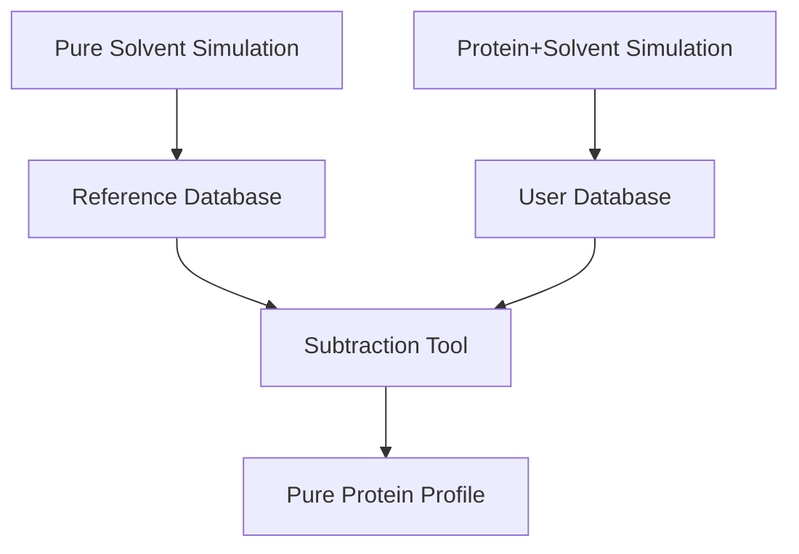

# Solvent Subtraction

Extract pure protein SAXS profiles by subtracting solvent contributions.

## Overview

pyCuSAXS provides tools to separate protein and solvent contributions:

**I<sub>protein</sub>(q) = I<sub>total</sub>(q) - I<sub>solvent</sub>(q)**

This is achieved using a two-database system:

1. **Reference Database**: Pure solvent profiles (read-only, shipped with package)
2. **User Database**: Your protein+solvent calculations (read-write)

## Workflow



## Step-by-Step Guide

### Step 1: Check Reference Database

List available reference solvents:

```bash
python -m pycusaxs.saxs_db_tool list \
    --db /path/to/pyCuSaxs/data/reference_solvents.db
```

Example output:

```
ID    Water    Ions    Box (Å)              Scale    Time (ps)
1     TIP3P    none    100.0x100.0x100.0    2.500    50000.0
2     TIP4P    none    100.0x100.0x100.0    2.500    50000.0
3     SPC      none    100.0x100.0x100.0    2.500    50000.0
4     SPCE     none    100.0x100.0x100.0    2.500    50000.0
```

### Step 2: Calculate Protein+Solvent SAXS

Run your protein+solvent system:

```bash
pycusaxs -s lysozyme_tip3p.tpr -x lysozyme_tip3p.xtc \
    -g 128 -b 0 -e 10000 --gridS 320 \
    -o lysozyme_total.dat \
    --save-db
```

This:

- Calculates SAXS for entire system (protein + TIP3P water)
- Saves profile to `lysozyme_total.dat`
- Stores metadata in user database

### Step 3: Verify Your Profile

Check what was saved:

```bash
python -m pycusaxs.saxs_db_tool list
```

Example output:

```
ID    Water    Ions    Box (Å)              Scale    Time (ps)
1     TIP3P    Na:38   100.0x100.0x100.0    2.500    10000.0
```

### Step 4: Subtract Solvent

Extract pure protein contribution:

```bash
python -m pycusaxs.saxs_subtract \
    --protein-id 1 \
    --solvent-id 1 \
    -o lysozyme_protein.dat
```

Arguments:

- `--protein-id 1`: Your lysozyme profile (from user database)
- `--solvent-id 1`: TIP3P reference (from reference database)
- `-o lysozyme_protein.dat`: Output file for pure protein profile

Output:

```
Subtraction completed successfully!
Input: Protein+Solvent (ID 1) - Solvent (ID 1)
Output: lysozyme_protein.dat
Data points: 57
```

### Step 5: Analyze Result

The output file `lysozyme_protein.dat` contains:

```csv
# SAXS Profile Subtraction
# Protein+Solvent Profile ID: 1 (from user database)
#   Water Model: TIP3P
#   Box: 100.0 x 100.0 x 100.0 Å
#   Supercell Scale: 2.5000
#
# Pure Solvent Profile ID: 1 (from reference database)
#   Water Model: TIP3P
#   Box: 100.0 x 100.0 x 100.0 Å
#   Supercell Scale: 2.5000
#
# Result: I_protein(q) = I_total(q) - I_solvent(q)
#
# q (1/Å), I(q) (1/ų)
0.026000  1.234567e-02
0.052000  9.876543e-03
...
```

## Alternative: File-Based Subtraction

If you prefer working with .dat files directly:

```bash
python -m pycusaxs.saxs_subtract \
    --protein-file lysozyme_total.dat \
    --solvent-file tip3p_reference.dat \
    -o lysozyme_protein.dat
```

## Important Considerations

### Matching Conditions

For accurate subtraction, ensure:

✅ **Same water model** (TIP3P, TIP4P, SPC, SPCE)
✅ **Similar box size** (interpolation handles small differences)
✅ **Same supercell scale factor**
✅ **Similar simulation length** (better statistics)

### Box Size Tolerance

The subtraction tool automatically interpolates profiles, so small box size differences are acceptable:

```python
# Reference: 100 Å box
# Your system: 98 Å box
# ✓ Subtraction will work (2% difference, interpolated)
```

### Ion Handling

If your protein system contains ions:

- Reference should be **pure water** (no ions)
- Subtraction yields: **protein + ion contributions**
- For most cases, ion contribution is negligible

### Volume Normalization

Both profiles must be volume-normalized (pyCuSAXS does this automatically):

- I(q) is in units of **1/Ų** (per unit volume)
- Ensures proper subtraction regardless of system size

## Complete Example

```bash
# === User: Complete workflow ===

# 1. Calculate protein+solvent
pycusaxs -s lysozyme.tpr -x lysozyme.xtc \
    -g 128 -b 0 -e 10000 --gridS 320 --save-db

# 2. Check your profiles
python -m pycusaxs.saxs_db_tool list
# Output: ID 1, TIP3P system

# 3. Check reference database
python -m pycusaxs.saxs_db_tool list \
    --db /path/to/data/reference_solvents.db
# Output: ID 1 is TIP3P

# 4. Subtract
python -m pycusaxs.saxs_subtract \
    --protein-id 1 --solvent-id 1 -o lysozyme_only.dat

# 5. Done! lysozyme_only.dat contains pure protein scattering
```

## Troubleshooting

### Q: Which reference solvent should I use?

A: Match the water model in your protein simulation:

- Protein in TIP3P → Use reference ID for TIP3P
- Protein in TIP4P → Use reference ID for TIP4P

Check with:

```bash
python -m pycusaxs.saxs_db_tool info 1  # Check your protein system
```

### Q: What if I used a different box size?

A: No problem! The tool interpolates:

```bash
# Reference: 100 Å box
# Your system: 85 Å box
# ✓ Works fine (interpolated automatically)
```

### Q: Can I subtract from a .dat file instead?

A: Yes! Use file mode:

```bash
python -m pycusaxs.saxs_subtract \
    --protein-file my_protein.dat \
    --solvent-file reference.dat \
    -o result.dat
```

### Q: The subtracted intensity goes negative!

A: This can happen if:

- Wrong solvent model used (check water model matches)
- Protein system has different density
- Statistical noise at high q

Solution: Ensure water models match and check system composition.

## Command Reference

### Subtract (Database Mode)

```bash
python -m pycusaxs.saxs_subtract \
    --protein-id <ID> \       # From user database
    --solvent-id <ID> \       # From reference database
    -o output.dat             # Output file
```

Optional:

```bash
    --user-db <path>          # Custom user database
    --reference-db <path>     # Custom reference database
```

### Subtract (File Mode)

```bash
python -m pycusaxs.saxs_subtract \
    --protein-file <file> \   # Protein+solvent .dat
    --solvent-file <file> \   # Pure solvent .dat
    -o output.dat             # Output file
```

## Next Steps

- Learn about [Database Management](database.md)
- See [CLI Guide](cli.md) for calculation options
- Check [Python API](python-api.md) for programmatic access
